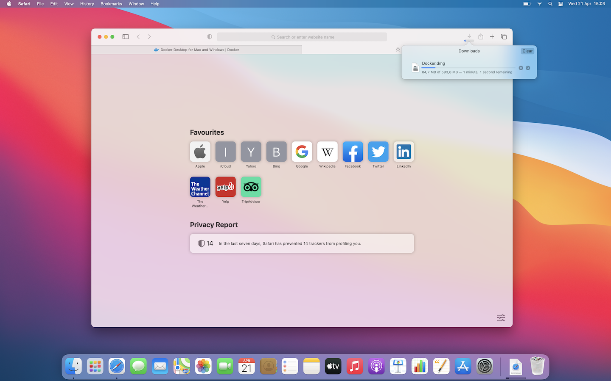
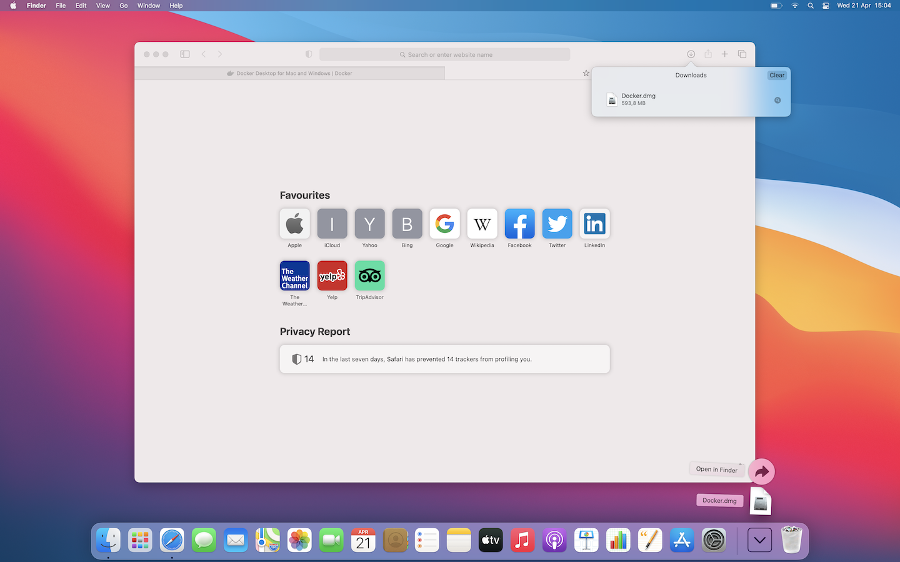
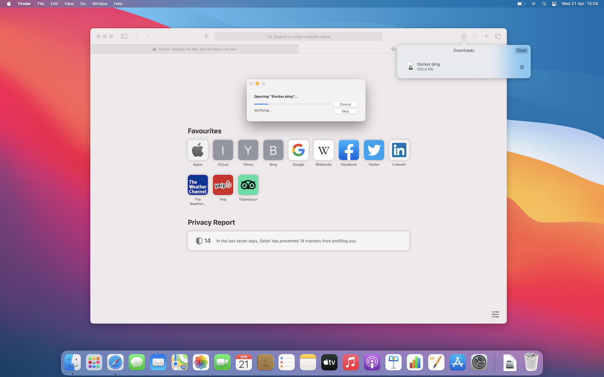
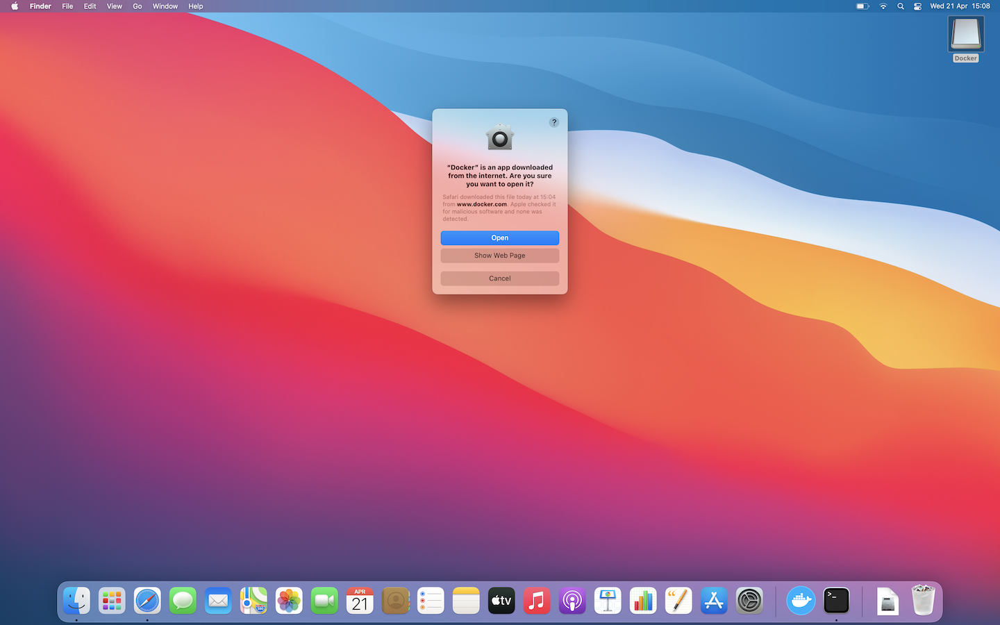
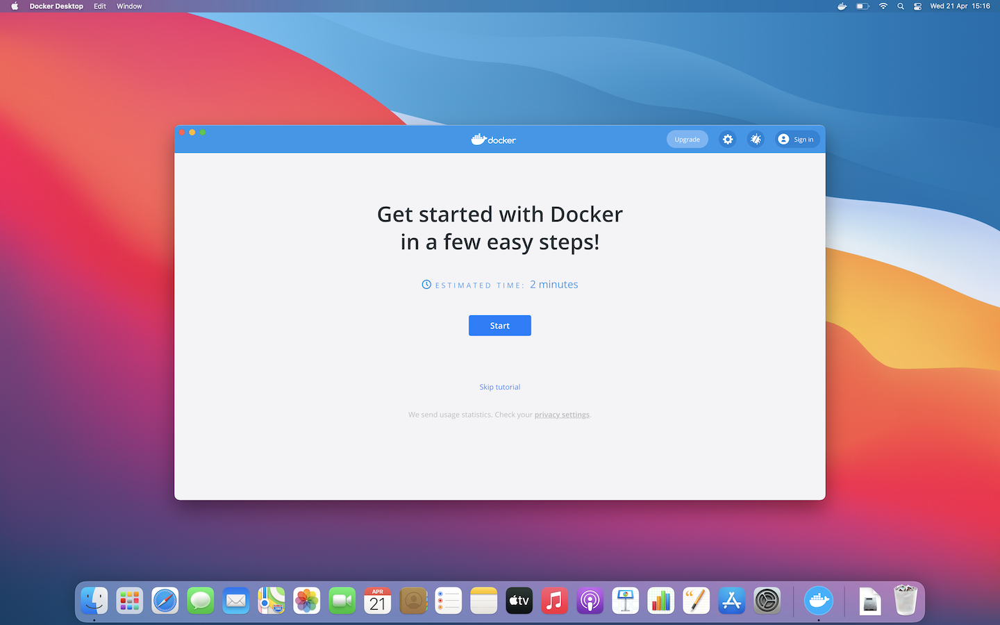

# Mac


These instructions are specific to Mac. Instructions are also available for [Windows](broken-reference) and [Linux](broken-reference).


## 1. Download Docker Desktop

You can download Docker Desktop by accessing [this link for Intel Macs](https://desktop.docker.com/mac/stable/amd64/Docker.dmg) or [this link for Apple chip Macs](https://desktop.docker.com/mac/stable/arm64/Docker.dmg).



After the download finishes you can find the dmg file in the `Downloads` directory on the Dock.



Open the `Docker.dmg` file.



You should see a window similar to the following. Drag and drop the Docker app file into the Applications folder.


You may get a notice like this because the app was downloaded from the web and not installed from the App Store. You can safely click "Open" here.



Docker also needs some privileges to install the Docker Helper. Click "OK" and enter your password.


Now you can open Finder and go to the Applications folder. You should see the Docker app.

_NOTE: You can also press `CMD` + `SPACE` and search for Docker_


After opening the application you should see a screen similar to this:


When Docker starts you should see this screen. We can close the Docker window now.



## 2. Open Terminal

We need to use the `Terminal` application in order to start the Daily Node image.

You can find the app in the `Utilities` directory under `Applications`.


Open the terminal application.

_NOTE: You can also press `CMD` + `SPACE` and search for Terminal_


You should see a window similar to this:


## 3. Start Daily

We have to run the following commands one by one:

```bash
cd ~/Desktop
curl -L https://github.com/dailycrypto-me/daily-ops/archive/refs/heads/master.zip > master.zip && unzip master.zip && rm -f master.zip
```


GitHub is blocked in some countries. If you can't run the previous command please refer to the [GitHub is blocked](https://docs.dailycrypto.me/node-setup/testnet\_node\_setup/github\_blocked) document.


```bash
cd ~/Desktop/daily-ops-master/daily_compose
docker-compose up -d
docker-compose logs -f
```

Now Docker is pulling the Daily Node image. You should see something similar to this:


After it finishes pulling the latest version the node will start and you should see something similar to the following:


\*\*NOTE: \*\*_You can press_ `CTRL` + `C` _to stop displaying the logs_

## 4. Updating the Daily Node

From time to time we will release new versions of the node software. Try to keep it up to date using the following commands:

```bash
cd ~/Desktop/daily-ops-master/daily_compose
curl -0 https://raw.githubusercontent.com/dailycrypto-me/daily-ops/master/daily_compose/docker-compose.yml > docker-compose-new.yml && mv docker-compose-new.yml docker-compose.yml
```


GitHub is blocked in some countries. If you can't run the previous command please refer to the [GitHub is blocked](https://github.com/dailycrypto-me/daily-documentation/tree/f4ee57d43b23f5ad4a2212fa5ec90254d9181f92/node-setup/testnet\_node\_setup/node-setup/github\_blocked.md) document.


```bash
docker-compose down
docker-compose pull
docker-compose up -d
docker-compose logs -f
```

During the testing period, we will also make changes on the protocol level and you will have to re-sync all the data. Don't worry, we will let you know. To remove the current data and do a full re-sync you have to run the following commands:

```bash
cd ~/Desktop/daily-ops-master/daily_compose
docker-compose down -v
docker-compose pull
docker-compose up -d
docker-compose logs -f
```
